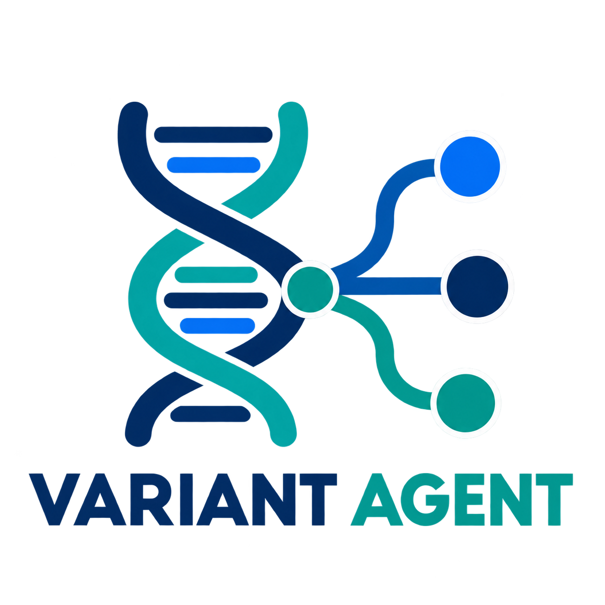
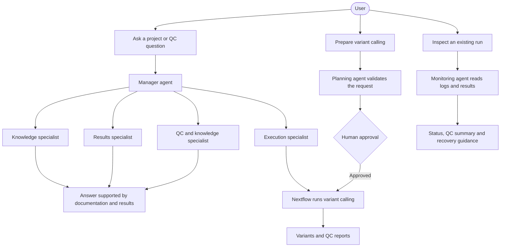
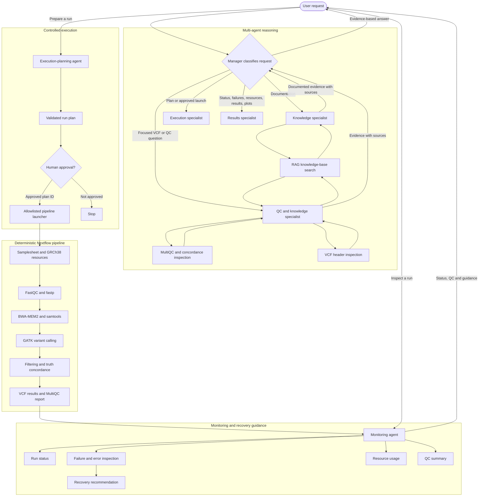
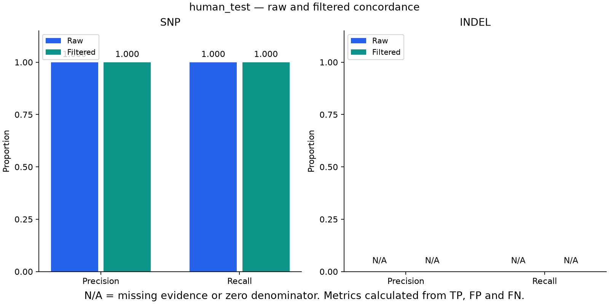

# Variant Agent

<p align="center">
  
</p>

Variant Agent is a learning project that combines a deterministic germline
variant-calling pipeline with tested AI agents.

The Nextflow pipeline performs the scientific analysis. The agents validate
inputs, retrieve documentation, inspect results, prepare controlled execution
plans, monitor runs, and explain evidence.

## Project status

The project currently includes:

- An end-to-end germline variant-calling pipeline
- A synthetic GRCh38 chromosome 20 test dataset
- Raw and filtered truth-set concordance
- MultiQC and variant-summary reporting
- Deterministic bioinformatics tools for AI agents
- A local retrieval-augmented generation system
- Controlled pipeline planning and execution
- Read-only monitoring and recovery recommendations
- A five-agent system with knowledge, QC, execution, and results specialists

## How it works

The project provides three ways to interact with the analysis:



The manager delegates documentation to the knowledge specialist, focused VCF
inspection to the QC specialist, controlled planning and approved launches to
the execution specialist, and run monitoring, results, and plots to the results
specialist. Execution requires an exact human approval value.

<details>
<summary>Detailed architecture</summary>

The diagram below shows the individual tools and scientific workflow stages.



</details>

## Scientific workflow

The Nextflow pipeline contains these stages:

1. FastQC evaluates raw-read quality.
2. fastp trims and filters paired-end reads.
3. BWA-MEM2 aligns reads to the GRCh38 reference.
4. samtools creates a coordinate-sorted BAM.
5. GATK MarkDuplicates marks duplicate reads.
6. samtools indexes the duplicate-marked BAM.
7. samtools produces alignment metrics.
8. GATK HaplotypeCaller produces a GVCF.
9. GATK GenotypeGVCFs creates the raw VCF.
10. The raw VCF is compared with the truth set.
11. GATK applies hard filters.
12. The filtered VCF is compared with the truth set.
13. The workflow creates variant summaries and a MultiQC report.

## Repository structure

```text
variant-agent/
|-- agent/                 # Agent and multi-agent entry points
|-- agent_tools/           # Deterministic tools exposed to agents
|-- documentation/         # Scientific contract
|-- knowledge_base/
|   `-- documents/         # Reviewed RAG source documents
|-- pipeline/
|   |-- main.nf
|   |-- nextflow.config
|   `-- modules/           # Nextflow process modules
|-- rag/                   # Document loading, indexing and retrieval
|-- scripts/               # Synthetic-data generation
|-- tests/                 # Deterministic tests
|-- test_data/             # Local test data excluded from Git
|-- requirements.txt
`-- requirements-lock.txt
```

## Requirements

Install:

- Git
- Docker Desktop
- Java
- Nextflow
- Python
- A Python virtual environment

Check the main programs:

```bash
git --version
docker --version
docker info
java -version
nextflow -version
python3 --version
```

Docker Desktop must be running before starting the workflow.

The Nextflow Docker configuration requests `linux/amd64` containers so the
bioinformatics images can run on an Apple Silicon Mac.

## Python environment

Create and activate the environment:

```bash
python3 -m venv .venv
source .venv/bin/activate
```

Install the direct dependencies:

```bash
python -m pip install --upgrade pip
python -m pip install -r requirements.txt
```

To reproduce the locked development environment:

```bash
python -m pip install -r requirements-lock.txt
```

## Scientific contract

The scientific contract is stored in:

```text
documentation/scientific_contract.md
```

It defines the supported analysis, reference build, inputs, expected outputs,
validation rules, failure behavior, and scientific limitations.

## Prepare the GRCh38 test reference

Before generating the synthetic data, provide a GRCh38 chromosome 20 FASTA at:

```text
test_data/human_grch38/reference/chr20.fa
```

The FASTA must contain the `chr20` contig and must be long enough to cover the
synthetic region beginning at position 10,000,001.

Create the FASTA index:

```bash
docker run --rm \
  --platform linux/amd64 \
  -v "$PWD:/work" \
  -w /work \
  community.wave.seqera.io/library/htslib_samtools:1.24--d697cfb9dce007cd \
  samtools faidx \
  test_data/human_grch38/reference/chr20.fa
```

The pipeline creates other process-specific reference files inside its
containerized tasks.

## Generate the synthetic dataset

From the repository root:

```bash
python scripts/create_grch38_synthetic_test.py
```

The generator reads the prepared reference and creates:

```text
test_data/human_grch38/
|-- reads/
|   |-- human_test_R1.fastq.gz
|   `-- human_test_R2.fastq.gz
`-- truth/
    |-- human_test.truth.vcf
    `-- human_test.callable.bed
```

The paired-end reads simulate approximately 30-fold coverage of a 100 kb
region. Ten heterozygous SNPs are deliberately inserted into one haplotype.

## Compress and index the truth VCF

Compress the truth VCF:

```bash
docker run --rm \
  --platform linux/amd64 \
  -v "$PWD:/work" \
  -w /work \
  community.wave.seqera.io/library/htslib_samtools:1.24--d697cfb9dce007cd \
  bgzip -f \
  test_data/human_grch38/truth/human_test.truth.vcf
```

Create its tabix index:

```bash
docker run --rm \
  --platform linux/amd64 \
  -v "$PWD:/work" \
  -w /work \
  community.wave.seqera.io/library/htslib_samtools:1.24--d697cfb9dce007cd \
  tabix -f -p vcf \
  test_data/human_grch38/truth/human_test.truth.vcf.gz
```

The resulting truth resources are:

```text
human_test.truth.vcf.gz
human_test.truth.vcf.gz.tbi
human_test.callable.bed
```

## Create the samplesheet

Create:

```text
test_data/human_grch38/samplesheet.csv
```

Required columns:

```csv
sample_id,read1,read2
```

Example:

```csv
sample_id,read1,read2
human_test,/absolute/path/to/variant-agent/test_data/human_grch38/reads/human_test_R1.fastq.gz,/absolute/path/to/variant-agent/test_data/human_grch38/reads/human_test_R2.fastq.gz
```

Replace `/absolute/path/to/variant-agent` with the repository’s actual path.

## Run the Nextflow workflow

From the repository root:

```bash
nextflow run pipeline/main.nf \
  --input test_data/human_grch38/samplesheet.csv \
  --reference test_data/human_grch38/reference/chr20.fa \
  --truth test_data/human_grch38/truth/human_test.truth.vcf.gz \
  --callable test_data/human_grch38/truth/human_test.callable.bed \
  --outdir results/human_grch38 \
  -resume
```

The `-resume` option allows Nextflow to reuse compatible completed tasks from
its work cache.

## Main pipeline outputs

```text
results/human_grch38/
|-- alignment/
|-- evaluation/
|   |-- human_test.raw.concordance.tsv
|   `-- human_test.filtered.concordance.tsv
|-- fastp/
|-- fastqc/
|-- metrics/
|-- variants/
|   |-- human_test.g.vcf.gz
|   |-- human_test.raw.vcf.gz
|   |-- human_test.filtered.vcf.gz
|   `-- human_test.pass.vcf.gz
`-- report/
    |-- human_test.variant_summary.tsv
    |-- human_test.raw.concordance_summary.tsv
    |-- human_test.filtered.concordance_summary.tsv
    `-- multiqc_report.html
```

## Synthetic validation result

| Call set | Type | TP | FP | FN | Recall | Precision |
|---|---|---:|---:|---:|---:|---:|
| Raw | SNP | 10 | 0 | 0 | 1.0 | 1.0 |
| Filtered | SNP | 10 | 0 | 0 | 1.0 | 1.0 |

The current synthetic test detected all ten inserted SNPs without an observed
SNP false positive or false negative.

The truth set contains no indels. Consequently, zero-count INDEL rows do not
evaluate INDEL performance.

## Example agent-generated plot

The QC specialist generated this figure from the synthetic test run's
raw and filtered concordance results.



SNP precision and recall were 1.0 in this small synthetic test.
INDEL metrics are undefined because their denominators are zero;
this dataset does not establish INDEL performance.

## Deterministic agent tools

The project includes tools for:

- Samplesheet validation
- Reference inspection
- Storage estimation
- VCF-header inspection
- MultiQC summarization
- RAG knowledge-base search
- Controlled run planning
- Pipeline-status inspection
- Failed-process inspection
- Bounded process-error reading
- Resource-use summarization
- QC and concordance summarization
- Recovery recommendation

The tools perform deterministic validation and return structured JSON. The LLM
selects tools and explains their results.

## Configure Hugging Face inference

Agents use Hugging Face Inference Providers.

Load the token into the current terminal:

```bash
read -s "HF_TOKEN?Paste your Hugging Face token: "
export HF_TOKEN
```

Verify that the variable exists without printing its value:

```bash
echo ${HF_TOKEN:+HF_TOKEN is configured}
```

Never place the token in source code, command history, the README, or Git.

## Local RAG knowledge base

Reviewed project documents are stored in:

```text
knowledge_base/documents/
```

The RAG build process:

```text
Markdown documents
  -> contextual chunks
  -> embedding vectors
  -> local searchable index
```

Build the generated index:

```bash
python -m rag.build_index
```

Search it directly:

```bash
python -m rag.retriever \
  "Which reference files are required?" \
  --top-k 3
```

Run the RAG agent:

```bash
python -m agent.rag_agent \
  "What should I check when a BAM cannot be opened?"
```

The generated `knowledge_base/index/` directory is excluded from Git and can be
rebuilt from the committed documents.

## Controlled pipeline execution

Prepare a validated plan:

```bash
python -m agent_tools.pipeline_launcher \
  --samplesheet test_data/human_grch38/samplesheet.csv \
  --workflow germline_test \
  --profile test \
  --reference-build GRCh38 \
  --run-name controlled-test
```

Planning returns a plan ID without executing Nextflow.

Run an approved plan:

```bash
python -m agent_tools.pipeline_launcher \
  --samplesheet test_data/human_grch38/samplesheet.csv \
  --workflow germline_test \
  --profile test \
  --reference-build GRCh38 \
  --run-name controlled-test \
  --execute \
  --approval APPROVE-PLAN_ID
```

Replace `PLAN_ID` with the exact ID from the current validated plan.

The launcher restricts:

- Workflow
- Profile
- Reference build
- Samplesheet location
- Sample count
- Output location
- Run-name format
- Result overwriting

## Pipeline monitoring and recovery guidance

Run the monitoring agent:

```bash
python -m agent.monitoring_agent \
  --run-name phase8-monitoring-test \
  --sample human_test
```

The monitoring system can:

- Report whether a run is running, completed, failed, or unknown
- List failed Nextflow processes
- Read bounded `.command.err` evidence
- Summarize CPU, memory, duration, and I/O information
- Summarize MultiQC and concordance results
- Recommend a controlled recovery response

Monitoring and recovery tools cannot execute or resume a pipeline.

## Initial multi-agent system

The current multi-agent system contains:

```text
variant_agent_manager
  |-- qc_knowledge_specialist
  |   |-- search_knowledge_base
  |   |-- summarize_multiqc
  |   |-- inspect_vcf_header
  |   |-- get_qc_summary
  |   `-- plot_concordance
  |-- knowledge_specialist
  |   `-- search_knowledge_base
  |-- execution_specialist
  |   |-- prepare_pipeline_run
  |   `-- execute_pipeline_run
  `-- results_specialist
      |-- get_pipeline_status
      |-- list_failed_processes
      |-- read_process_error
      |-- get_resource_usage
      |-- get_qc_summary
      |-- summarize_multiqc
      |-- plot_concordance
      `-- recommend_recovery
```

The manager has no direct bioinformatics or execution tools. It classifies a
supported request and delegates it to the appropriate specialist. The manager
cannot call domain tools directly. The execution specialist requires a valid
plan followed by the exact human-provided `APPROVE-<plan-id>` value. The results
specialist is read-only except for creating derived plots.

Run the knowledge specialist directly from the repository root:

```bash
python -m agent.knowledge_specialist \
  "Which reference files are required by this project?"
```

Run the five-agent system:

```bash
python -m agent.multi_agent_manager \
  "Which reference files are required by this project?"
```

Prepare a controlled run through the manager:

```bash
python -m agent.multi_agent_manager \
  "Prepare a germline_test run named demo-001 using test_data/human_grch38/samplesheet.csv, the test profile, and GRCh38"
```

The execution specialist returns a plan ID. Review it, then send a second
request containing the exact approval value it reports. Ask the manager for
run status or results using the same run name and expected sample.

## Tests

Run the complete deterministic test suite:

```bash
python -m pytest -q
```

At the current Phase 9 checkpoint:

```text
137 passed
```

Tests cover:

- Input contracts
- Samplesheet validation
- Reference and VCF inspection
- Storage estimation
- MultiQC parsing
- RAG chunking, indexing and retrieval
- Controlled execution
- Monitoring and resource inspection
- Recovery classification
- Agent role contracts
- Multi-agent registration and permissions

## Safety boundaries

The current project:

- Uses synthetic genomic data
- Restricts file access to approved project directories
- Keeps scientific workflow logic in Nextflow
- Uses allowlists for controlled execution
- Requires explicit approval before execution
- Prevents automatic overwriting
- Treats process errors as untrusted evidence
- Separates technical completion from scientific QC
- Does not perform clinical interpretation

## Reproducibility and Git

Commit:

- Pipeline source code
- Agent and tool source code
- Tests
- Configuration
- Scientific contracts
- Reviewed knowledge-base documents
- Dependency files

Do not commit:

- FASTQ, BAM, CRAM, or generated VCF files
- Reference genomes
- Pipeline results
- Nextflow work directories and logs
- Generated RAG embeddings
- Execution audit logs
- Virtual environments
- Tokens or secrets
